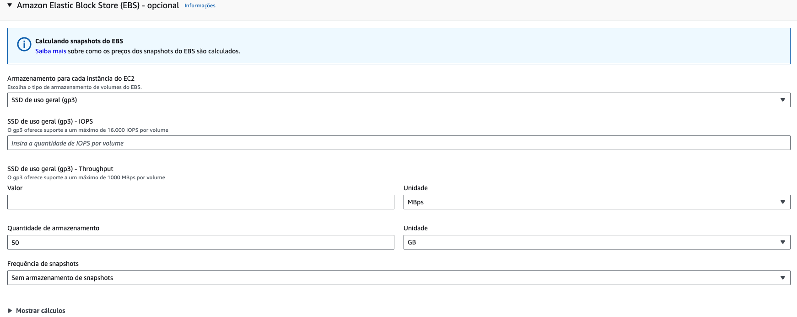
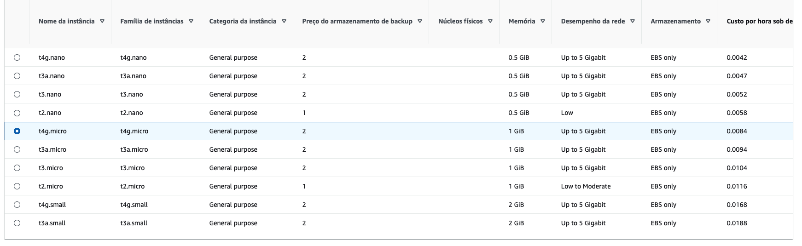
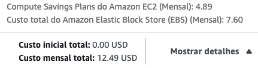
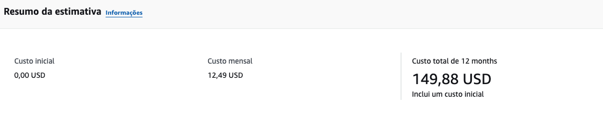
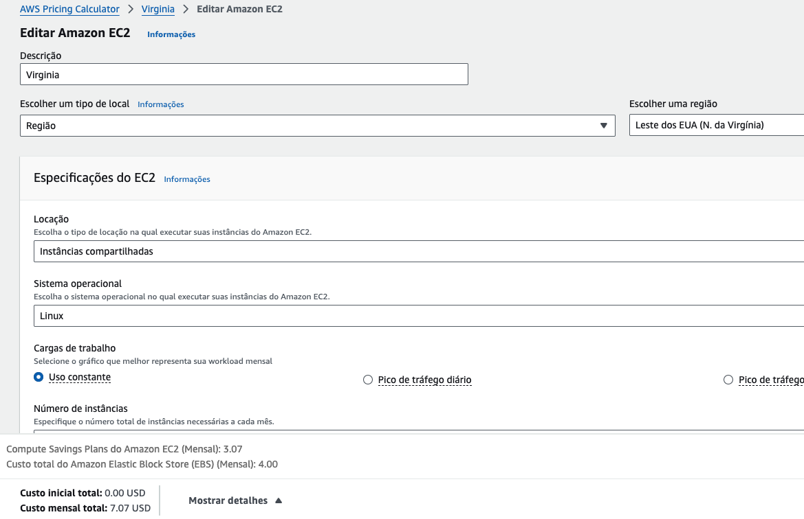
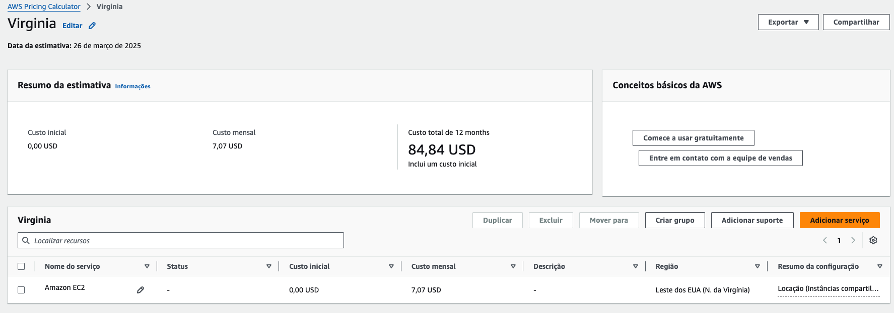

# FIAP - Faculdade de Informática e Administração Paulista

<p align="center">
<a href= "https://www.fiap.com.br/"></a>
</p>

<br>

# FarmTech Solutions - Análise de Rendimento de Safra

## 🔗 Links Importantes
- [Notebook Completo do Projeto](notebooks/GabrielMule_rm560586_pbl_fase4.ipynb) | [Versão Markdown](GabrielMule_rm560586_pbl_fase4/README.md)
- [Análise de Custos AWS](fase5_analise_aws.md)
- [Notebook Fase 1: Preparação do Ambiente](notebooks/fase1_preparo_ambiente.ipynb)
- [Notebook Fase 2: Análise Exploratória](notebooks/fase2_analise_exploratoria.ipynb)
- [Notebook Fase 3: Clusterização](notebooks/fase3_clusterizacao.ipynb)
- [Notebook Fase 4: Modelagem Preditiva](notebooks/fase4_modelagem_preditiva.ipynb)

## 👨‍🎓 Integrantes: 
- <a href="https://www.linkedin.com/in/gabemule/">Gabriel Mule Monteiro</a>

## 👩‍🏫 Professores:
### Tutor(a) 
- <a href="https://www.linkedin.com/company/inova-fusca">Lucas Gomes Moreira</a>

## 📜 Descrição

Este projeto implementa um sistema de análise de dados e machine learning para prever o rendimento de safras agrícolas com base em condições climáticas. A FarmTech Solutions utiliza dados de precipitação, umidade, temperatura e outras variáveis para criar modelos preditivos que auxiliam produtores rurais a otimizar sua produção.

O sistema realiza a análise das seguintes variáveis:
- Precipitação (mm/dia)
- Umidade específica a 2 metros (g/kg)
- Umidade relativa a 2 metros (%)
- Temperatura a 2 metros (°C)

Com base nessas variáveis, o sistema prevê o rendimento de diferentes culturas, incluindo:
- Cacau
- Óleo de palma
- Arroz
- Borracha natural

## 📊 Análise de Dados e Machine Learning

### Fase 1: Preparação do Ambiente e Dados
- Configuração do ambiente de desenvolvimento
- Carregamento e verificação inicial do dataset
- Análise das culturas presentes e sua distribuição

### Fase 2: Análise Exploratória de Dados
- Análise da distribuição das variáveis
- Identificação de correlações entre variáveis
- Análise de outliers
- Visualização de tendências entre condições climáticas e rendimento

### Fase 3: Clusterização (Aprendizado Não Supervisionado)
- Identificação de padrões naturais nos dados
- Segmentação em 4 clusters distintos
- Análise das características de cada cluster
- Identificação de outliers e cenários discrepantes

### Fase 4: Modelagem Preditiva (Regressão Supervisionada)
- Implementação de 5 modelos de regressão:
  * Regressão Linear
  * Árvore de Decisão
  * Random Forest
  * Gradient Boosting
  * Support Vector Regression (SVR)
- Comparação de desempenho entre modelos
- Identificação do melhor modelo (Regressão Linear)
- Análise da importância das variáveis

## ☁️ Estimativa de Custos na Nuvem AWS

Realizamos uma análise comparativa de custos para hospedar nossa API de machine learning nas regiões de São Paulo (BR) e Virgínia do Norte (EUA) na AWS.

### Requisitos de Infraestrutura
- 2 CPUs
- 1 GiB de memória RAM
- Até 5 Gigabit de rede
- 50 GB de armazenamento (HD)

### Comparação de Custos

| Componente | São Paulo (BR) | Virgínia do Norte (EUA) |
|------------|---------------|-------------------------|
| Instância EC2 | $4.89 USD | $3.07 USD |
| Armazenamento EBS | $7.60 USD | $4.00 USD |
| **Total Mensal** | **$12.49 USD** | **$7.07 USD** |








### Justificativa da Solução Escolhida

Optamos pela região **São Paulo (BR)** pelos seguintes motivos:

1. **Acesso rápido aos dados**: A latência reduzida (20-50ms vs 120-150ms) proporciona melhor experiência para usuários no Brasil e menor variabilidade para conexões domésticas.

2. **Restrições legais**: A LGPD impõe requisitos específicos para transferência internacional de dados, e dados agrícolas podem ser considerados estratégicos para segurança alimentar nacional.

3. **Relação custo-benefício**: Embora a região da Virgínia do Norte ofereça uma economia de aproximadamente 43.4%, esta diferença representa apenas $5.42 USD mensais, o que não justifica os riscos adicionais de conformidade legal e latência.

### Vídeo Demonstrativo

[Assista ao vídeo demonstrativo da comparação de custos na AWS](https://youtu.be/3UdfJljrStg)

## 📁 Estrutura de Arquivos

```
projeto/
├── notebooks/
│   ├── GabrielMule_rm560586_pbl_fase4.ipynb  # Notebook completo do projeto
│   ├── fase1_preparo_ambiente.ipynb          # Preparação do ambiente e dados
│   ├── fase2_analise_exploratoria.ipynb      # Análise exploratória de dados
│   ├── fase3_clusterizacao.ipynb             # Clusterização (não supervisionado)
│   └── fase4_modelagem_preditiva.ipynb       # Modelagem preditiva (supervisionado)
├── crop_yield.csv                            # Dataset com dados de rendimento de safras
├── fase5_analise_aws.md                      # Análise detalhada de custos AWS
├── setup_env.sh                              # Script para configuração do ambiente
└── README.md                                 # Este arquivo
```

### Arquivos Principais:

1. **notebooks/fase1_preparo_ambiente.ipynb**:
   - Configuração do ambiente de desenvolvimento
   - Carregamento e verificação inicial do dataset
   - Análise das culturas presentes

2. **notebooks/fase2_analise_exploratoria.ipynb**:
   - Análise da distribuição das variáveis
   - Identificação de correlações
   - Análise de outliers
   - Visualização de tendências

3. **notebooks/fase3_clusterizacao.ipynb**:
   - Preparação dos dados para clusterização
   - Determinação do número ideal de clusters
   - Aplicação do algoritmo K-Means
   - Visualização e interpretação dos clusters

4. **notebooks/fase4_modelagem_preditiva.ipynb**:
   - Implementação de 5 modelos de regressão
   - Avaliação e comparação de modelos
   - Análise da importância das variáveis
   - Documentação de resultados

5. **fase5_analise_aws.md**:
   - Análise detalhada de custos AWS
   - Comparação entre regiões São Paulo e Virgínia do Norte
   - Considerações sobre latência e restrições legais
   - Justificativa técnica para escolha da região

## 📺 Demonstração

O projeto pode ser testado através dos notebooks Jupyter, que demonstram:
- Análise exploratória dos dados
- Clusterização e identificação de padrões
- Modelagem preditiva e comparação de modelos
- Previsão de rendimento de safras

## 🗃 Histórico de lançamentos

* 1.0.0 - 19/03/2025
    * Implementação das fases 1-4 (notebooks)
    * Análise de custos AWS (fase 5)
    * Documentação completa do projeto

## 📋 Licença

<p xmlns:cc="http://creativecommons.org/ns#" xmlns:dct="http://purl.org/dc/terms/">MODELO GIT FIAP por <a rel="cc:attributionURL dct:creator" property="cc:attributionName" href="https://fiap.com.br">Fiap</a> está licenciado sobre <a href="http://creativecommons.org/licenses/by/4.0/?ref=chooser-v1" target="_blank" rel="license noopener noreferrer" style="display:inline-block;">Attribution 4.0 International</a>.</p>
